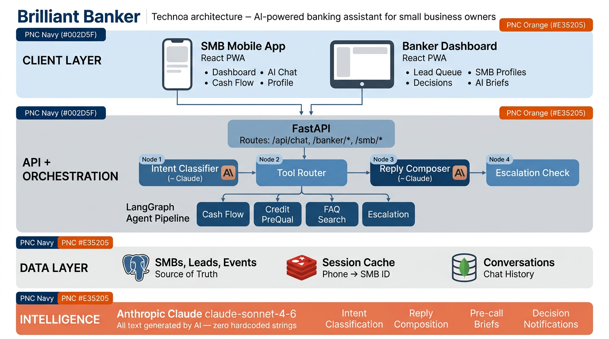
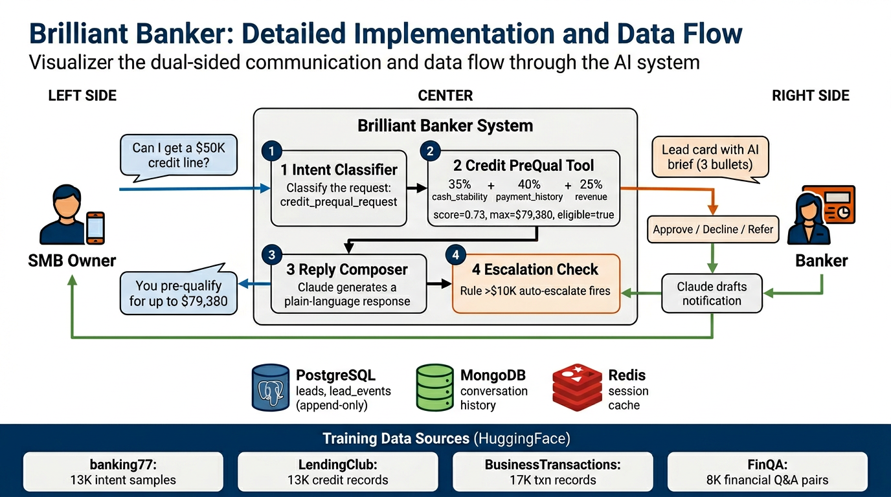

# Brilliant Banker — System Architecture

## Project Objective

Brilliant Banker is an AI-powered banking assistant that serves two users simultaneously:

1. **Small Business Owners (SMBs)** get an always-on financial advisor in their pocket — one that speaks plainly about cash flow, answers credit questions with specific dollar amounts, and seamlessly hands off to a human when needed.

2. **Relationship Bankers** get pre-qualified leads ranked by urgency, AI-generated pre-call briefs with specific numbers, and one-tap approve/decline/refer workflows — so they spend time on conversations, not data gathering.

The system closes the loop between both parties: when an SMB asks about a credit line, the AI scores them instantly, gives them a straight answer, and simultaneously surfaces a warm lead to their banker with a data-driven brief. When the banker acts, the SMB gets a personalized notification drafted by AI. No manual steps. No phone tag.

**Core thesis**: Every interaction between an SMB and their bank should make the AI smarter about that business, the banker more prepared for the next call, and the SMB more confident about their finances.

---

## Diagrams

### System Architecture Overview


### Implementation & Data Flow Detail


---

## High-Level System Architecture

```
┌─────────────────────────────────────────────────────────────────────────┐
│                         CLIENT LAYER                                    │
│                                                                         │
│   ┌─────────────────────┐              ┌─────────────────────┐          │
│   │   SMB Mobile App    │              │  Banker Dashboard   │          │
│   │   (React PWA)       │              │  (React PWA)        │          │
│   │                     │              │                     │          │
│   │  • Dashboard        │              │  • Lead queue       │          │
│   │  • AI Chat          │              │  • SMB profiles     │          │
│   │  • Cash flow view   │              │  • Decision actions │          │
│   │  • Profile          │              │  • AI pre-call brief│          │
│   └────────┬────────────┘              └────────┬────────────┘          │
│            │ POST /api/chat                     │ GET/POST /banker/*    │
│            │ GET  /api/chat/{id}/history         │ GET /smb/{id}/profile │
└────────────┼────────────────────────────────────┼───────────────────────┘
             │                                    │
             ▼                                    ▼
┌─────────────────────────────────────────────────────────────────────────┐
│                       API GATEWAY (FastAPI)                              │
│                                                                         │
│   /api/chat  ──────►  LangGraph Agent Pipeline                          │
│   /api/auth  ──────►  Session Management                                │
│   /banker/*  ──────►  Lead & Decision Handlers                          │
│   /smb/*     ──────►  Profile + AI Brief Generator                      │
│                                                                         │
│   Middleware: CORS │ Request Logging │ Error Handling                    │
└─────────────────────────────┬───────────────────────────────────────────┘
                              │
                              ▼
┌─────────────────────────────────────────────────────────────────────────┐
│                    ORCHESTRATION LAYER (LangGraph)                       │
│                                                                         │
│   ┌──────────────┐    ┌──────────────┐    ┌──────────────┐    ┌──────┐ │
│   │   Intent     │    │    Tool      │    │    Reply     │    │Escal.│ │
│   │  Classifier  │───►│   Router     │───►│  Composer    │───►│Check │ │
│   │  (Claude)    │    │              │    │  (Claude)    │    │      │ │
│   └──────────────┘    └──────┬───────┘    └──────────────┘    └──┬───┘ │
│                              │                                   │     │
│                   ┌──────────┼──────────┐              auto-escalate   │
│                   ▼          ▼          ▼              if > $10K       │
│             ┌──────────┐┌────────┐┌─────────┐                         │
│             │Cash Flow ││Credit  ││  FAQ    │                         │
│             │Forecast  ││PreQual ││ Search  │                         │
│             └──────────┘└────────┘└─────────┘                         │
└─────────────────────────────┬───────────────────────────────────────────┘
                              │
                              ▼
┌─────────────────────────────────────────────────────────────────────────┐
│                        DATA LAYER                                       │
│                                                                         │
│   ┌─────────────────┐  ┌──────────────┐  ┌──────────────────┐          │
│   │   PostgreSQL    │  │    Redis     │  │    MongoDB       │          │
│   │                 │  │              │  │                  │          │
│   │  • smbs         │  │  • phone →   │  │  • conversations │          │
│   │  • leads        │  │    smb_id    │  │    {smb_id,      │          │
│   │  • lead_events  │  │    session   │  │     role,        │          │
│   │  • bankers      │  │    cache     │  │     content,     │          │
│   │  • transactions │  │              │  │     timestamp}   │          │
│   │  • banker_notes │  │              │  │                  │          │
│   └─────────────────┘  └──────────────┘  └──────────────────┘          │
│                                                                         │
│   All Postgres writes are append-only (lead_events never UPDATE leads)  │
│   MongoDB stores unbounded conversation history per SMB                  │
│   Redis provides sub-ms session lookups                                  │
└─────────────────────────────────────────────────────────────────────────┘
             │
             ▼
┌─────────────────────────────────────────────────────────────────────────┐
│                    INTELLIGENCE LAYER (Claude claude-sonnet-4-6)              │
│                                                                         │
│   Every outbound message is generated by Claude — zero hardcoded text.  │
│                                                                         │
│   • Intent classification (JSON output, temp=0)                         │
│   • Reply composition (grounded on tool results, temp=0.3)              │
│   • Pre-call briefs (3-bullet analyst format)                           │
│   • Decision notifications (approve / decline / refer)                  │
└─────────────────────────────────────────────────────────────────────────┘
```

---

## LangGraph Agent Pipeline — Detail View

This is the core of the system. Every user message flows through a 4-node directed graph:

```
               ┌─────────────────────────────────────────────────┐
               │              AGENT STATE                        │
               │                                                 │
               │  {smb_id, phone, message, history[10],          │
               │   intent, tool_result, reply, escalated}        │
               └────────────────────┬────────────────────────────┘
                                    │
                                    ▼
               ┌─────────────────────────────────────────────────┐
               │          NODE 1: INTENT CLASSIFIER              │
               │                                                 │
               │  Claude call (temp=0, max_tokens=50)            │
               │  Input:  message + last 5 history turns         │
               │  Output: JSON {"intent": "..."}                 │
               │                                                 │
               │  Intents:                                       │
               │    • cash_flow_query                             │
               │    • credit_prequal_request                     │
               │    • faq_question                               │
               │    • escalate_to_banker                         │
               │    • general_chat                               │
               └────────────────────┬────────────────────────────┘
                                    │
                                    ▼
               ┌─────────────────────────────────────────────────┐
               │          NODE 2: TOOL ROUTER                    │
               │                                                 │
               │  Routes to one tool based on classified intent: │
               │                                                 │
               │  cash_flow_query ──────► get_cash_flow_forecast │
               │    → 30-day projection from SMB profile         │
               │    → risk flag (low/medium/high)                │
               │                                                 │
               │  credit_prequal_request ► check_credit_prequal  │
               │    → Parses $ amount from natural language      │
               │    → Weighted score: 35% cash_stability         │
               │                        40% payment_history      │
               │                        25% revenue (capped)     │
               │    → Returns: eligible, probability, max_amount │
               │                                                 │
               │  faq_question ─────────► search_faq             │
               │    → Keyword match against 7 FAQ entries        │
               │    → Returns: answer + confidence score         │
               │                                                 │
               │  escalate_to_banker ───► escalate_to_banker     │
               │    → Writes lead row to Postgres                │
               │    → Sets urgency_score                         │
               └────────────────────┬────────────────────────────┘
                                    │
                                    ▼
               ┌─────────────────────────────────────────────────┐
               │          NODE 3: REPLY COMPOSER                 │
               │                                                 │
               │  Claude call (temp=0.3, max_tokens=200)         │
               │  Input:  message + tool_result JSON + history   │
               │  Rules:  1-2 sentences, no jargon, no emoji,    │
               │          cite specific $ figures from results,  │
               │          never fabricate numbers                 │
               └────────────────────┬────────────────────────────┘
                                    │
                                    ▼
               ┌─────────────────────────────────────────────────┐
               │          NODE 4: ESCALATION CHECKER             │
               │                                                 │
               │  Business rule: credit requests > $10K          │
               │  automatically create a banker lead, even if    │
               │  the SMB pre-qualifies. This ensures high-value │
               │  opportunities always get human follow-up.      │
               │                                                 │
               │  Output: escalated = true/false                 │
               └────────────────────┬────────────────────────────┘
                                    │
                                    ▼
                                   END
```

---

## Communication Flow Between SMB Owner and Banker

This is the dual-sided interaction model that differentiates Brilliant Banker from a generic chatbot:

```
    SMB OWNER                     SYSTEM                        BANKER
    ─────────                     ──────                        ──────

    "Can I get a $50K             Intent: credit_prequal
     credit line?"                     │
         │                             ▼
         │                     ┌─ Credit PreQual Tool ─┐
         │                     │ score: 0.73           │
         │                     │ max: $79,380          │
         │                     │ eligible: true        │
         │                     └───────────────────────┘
         │                             │
         │                             ├──────────────────────►  Lead created
         │                             │                         urgency: HIGH
         │                             │                         status: pending
         ◄─────────────────────────────┤
    "You pre-qualify for               │
     up to $79,380 with                │
     0.73 probability."                │
                                       │
                                       │                    Banker opens lead
                                       │                    sees AI brief:
                                       │                    • $1.2M floral biz
                                       │                    • 72% cash stability
                                       │                    • Strong payment hx
                                       │
                                       │                    Taps "Approve $50K"
                                       │                           │
                                       │                           ▼
                                       │                    ┌─ Decision Event ─┐
                                       │                    │ action: approved  │
                                       │                    │ amount: $50,000   │
                                       │                    │ append-only write │
                                       │                    └──────────────────┘
                                       │                           │
                                       │                    Claude drafts
                                       │                    notification
                                       │                           │
         ◄─────────────────────────────┤───────────────────────────┘
    "Great news — your $50,000
     credit line has been
     approved by your banker."
```

### Integration Attributes

| Attribute | SMB → System | System → Banker | Banker → System → SMB |
|-----------|-------------|-----------------|----------------------|
| **Channel** | In-app chat | Lead queue + profile API | Decision API + notification |
| **Latency** | ~3-5s (Claude round-trip) | Real-time (WebSocket-ready) | ~2s (Claude drafts reply) |
| **Data passed** | Natural language message | Structured lead + AI brief | Action + amount + note |
| **AI involvement** | Intent classify + tool + compose | Pre-call brief generation | Notification drafting |
| **Persistence** | MongoDB (conversation) | Postgres (leads) | Postgres (lead_events, append-only) |
| **Escalation trigger** | Auto (>$10K) or explicit ask | Urgency-ranked queue | One-tap action buttons |

---

## Tech Stack Map

```
┌──────────────────────────────────────────────────────────────────┐
│  FRONTEND                                                        │
│                                                                  │
│  React 18 + Vite 6 + Tailwind CSS 3                              │
│  PNC brand: Navy #002D5F / Orange #E35205                        │
│  Mobile-first PWA, bottom tab nav, 5 screens                     │
│  Lucide icons, CSS animations (fade-up, typing dots)             │
│  API layer: fetch() with /api proxy via Vite                     │
└──────────────────────────────────────────────────────────────────┘
                              │
                              ▼
┌──────────────────────────────────────────────────────────────────┐
│  BACKEND                                                         │
│                                                                  │
│  Python 3.12 + FastAPI 0.115                                     │
│  Async throughout: asyncpg, motor, redis.asyncio                 │
│  LangGraph 0.2 — compiled StateGraph with 4 async nodes          │
│  Anthropic SDK 0.42 — claude-sonnet-4-6 for all LLM calls              │
│  Pydantic 2.10 — request/response validation + settings          │
│  SQLAlchemy 2.0 — async ORM with UUID primary keys               │
└──────────────────────────────────────────────────────────────────┘
                              │
                              ▼
┌──────────────────────────────────────────────────────────────────┐
│  DATA STORES                                                     │
│                                                                  │
│  PostgreSQL 16  — Source of truth for business entities           │
│                   Relational integrity (FK constraints)           │
│                   Append-only audit trail (lead_events)           │
│                                                                  │
│  MongoDB 7      — Document store for conversation history        │
│                   Schema-flexible (easy to add metadata)          │
│                   Time-sorted cursor queries                     │
│                                                                  │
│  Redis 7        — Session cache (phone→smb_id mapping)           │
│                   Sub-millisecond lookups                        │
│                   Connection pooling via redis.asyncio            │
└──────────────────────────────────────────────────────────────────┘
                              │
                              ▼
┌──────────────────────────────────────────────────────────────────┐
│  INFRASTRUCTURE                                                  │
│                                                                  │
│  Docker Compose — 5 services, health checks, hot reload          │
│  Volumes: pgdata (persistent), mongodata (persistent)            │
│  Network: default bridge (service discovery by name)             │
│  Environment: .env file, pydantic-settings auto-load             │
└──────────────────────────────────────────────────────────────────┘
```

---

## Database Schema

```
┌──────────────────────────┐       ┌──────────────────────────┐
│          smbs             │       │         bankers           │
├──────────────────────────┤       ├──────────────────────────┤
│ id          UUID (PK)    │       │ id          UUID (PK)    │
│ name        VARCHAR(200) │       │ name        VARCHAR(200) │
│ business_type VARCHAR    │       │ title       VARCHAR(200) │
│ annual_revenue    INT    │       │ region      VARCHAR(200) │
│ avg_monthly_revenue INT  │       │ email       VARCHAR(200) │
│ cash_stability  FLOAT    │       │ created_at  TIMESTAMP    │
│ payment_history FLOAT    │       └──────────┬───────────────┘
│ phone       VARCHAR(20)  │                  │
│ created_at  TIMESTAMP    │                  │
└──────────┬───────────────┘                  │
           │                                  │
           │ 1:N                              │ 1:N
           ▼                                  ▼
┌──────────────────────────┐       ┌──────────────────────────┐
│          leads            │       │      banker_notes         │
├──────────────────────────┤       ├──────────────────────────┤
│ id          UUID (PK)    │       │ id         UUID (PK)     │
│ smb_id      UUID (FK)    │       │ smb_id     UUID (FK→smbs)│
│ status      VARCHAR(20)  │       │ banker_id  UUID (FK)     │
│ requested_amount    INT  │       │ note       TEXT           │
│ credit_score      FLOAT  │       │ created_at TIMESTAMP     │
│ urgency_score     FLOAT  │       └──────────────────────────┘
│ reason            TEXT   │
│ created_at    TIMESTAMP  │       ┌──────────────────────────┐
└──────────┬───────────────┘       │      transactions         │
           │                       ├──────────────────────────┤
           │ 1:N (append-only)     │ id         UUID (PK)     │
           ▼                       │ smb_id     UUID (FK→smbs)│
┌──────────────────────────┐       │ description VARCHAR(300) │
│       lead_events         │       │ amount     INT (+/-)     │
├──────────────────────────┤       │ category   VARCHAR(100)  │
│ id          UUID (PK)    │       │ txn_date   TIMESTAMP     │
│ lead_id     UUID (FK)    │       │ created_at TIMESTAMP     │
│ action      VARCHAR(20)  │       └──────────────────────────┘
│ amount      INT          │
│ banker_note TEXT          │       ┌──────────────────────────┐
│ banker_id   VARCHAR(100) │       │  MongoDB: conversations   │
│ sms_sent    TEXT          │       ├──────────────────────────┤
│ created_at  TIMESTAMP    │       │ smb_id    string          │
└──────────────────────────┘       │ role      "user"|"assistant"
                                   │ content   string          │
                                   │ timestamp datetime (UTC)  │
                                   └──────────────────────────┘
```

---

## Credit Pre-Qualification Scoring Model

The current prototype uses a weighted linear model. Here's the formula and how to evolve it:

```
                    ┌─────────────────────────────────────┐
                    │        CURRENT (Prototype)          │
                    │                                     │
                    │  score = cash_stability   × 0.35    │
                    │        + payment_history  × 0.40    │
                    │        + revenue_factor   × 0.25    │
                    │                                     │
                    │  revenue_factor = min(monthly/100K, 1.0)
                    │  max_amount = monthly × 3 × score   │
                    │  eligible = score ≥ 0.55            │
                    │            AND requested ≤ max      │
                    └─────────────────┬───────────────────┘
                                      │
                              PRODUCTION EVOLUTION
                                      │
                                      ▼
                    ┌─────────────────────────────────────┐
                    │     TARGET (ML-trained model)        │
                    │                                     │
                    │  Train on HuggingFace datasets:     │
                    │  → Lending Club for credit features  │
                    │  → Business transactions for cash    │
                    │     flow pattern recognition         │
                    │                                     │
                    │  Model: XGBoost or LightGBM         │
                    │  Features: 15-20 engineered from     │
                    │    transaction history, seasonality,  │
                    │    industry benchmarks, payment       │
                    │    velocity, revenue trend slope      │
                    │                                     │
                    │  Output: P(default), max_amount,     │
                    │          risk_tier, confidence        │
                    └─────────────────────────────────────┘
```

---

## HuggingFace Datasets for Training

These datasets map directly to the four core capabilities of the system. Each one can replace or augment the current mock/rule-based implementation with a trained model.

### Layer 1 — Intent Classification

| Dataset | Size | What it gives you |
|---------|------|-------------------|
| [`banking77`](https://huggingface.co/datasets/gtfintechlab/banking77) | 13,083 queries, 77 intents | Fine-grained banking intent detection. Map the 77 intents down to our 5 categories. Use as training data for a fine-tuned classifier that replaces the Claude intent call, cutting latency from ~1s to ~50ms. |
| [`banking-intent-english`](https://huggingface.co/datasets/learn-abc/banking-intent-english) | 42,558 samples, 14 intents | Production-validated at 98% F1. Includes FALLBACK class for safety. Direct fit for our 5-intent schema with minor relabeling. |
| [`banking-intent-classification`](https://huggingface.co/datasets/Cleanlab/banking-intent-classification) | 1,000 samples | Smaller, cleaner set for quick fine-tuning. Good for a LoRA adapter on a small model. |

**Implementation path**: Fine-tune `distilbert-base-uncased` on `banking77` mapped to our 5 intents. Deploy as a local model in the tool_router, fall back to Claude only for low-confidence classifications. Cuts per-message latency by ~1 second.

### Layer 2 — Credit Risk & Loan Scoring

| Dataset | Size | What it gives you |
|---------|------|-------------------|
| [`TheFinAI/cra-lendingclub`](https://huggingface.co/datasets/TheFinAI/cra-lendingclub) | 13,453 loan records | Credit risk assessment with real lending data. Features: income, DTI, employment, credit history. Train an XGBoost model to replace our weighted linear formula. |
| [`idoaidan/lending-club-eda`](https://huggingface.co/datasets/idoaidan/lending-club-eda) | 10,000 records, 16 features | Clean tabular data with grade classifications (A-G). Map grades to our eligible/not-eligible binary + probability score. |

**Implementation path**: Train XGBoost on Lending Club features → map to our schema (cash_stability ↔ DTI inverse, payment_history ↔ delinquency rate, revenue ↔ annual income). Export as ONNX, load in `check_credit_prequal()` tool. The model returns calibrated probabilities instead of a fixed formula.

### Layer 3 — Cash Flow & Transaction Analysis

| Dataset | Size | What it gives you |
|---------|------|-------------------|
| [`utkarshugale/BusinessTransactions`](https://huggingface.co/datasets/utkarshugale/BusinessTransactions) | 17,667 transactions | Business transaction categorization. Train a classifier to auto-tag incoming transactions by category (payroll, supplies, revenue, etc.) for real-time cash flow decomposition. |
| [SME Transaction Categorization (arXiv:2508.05425)](https://arxiv.org/abs/2508.05425) | Research + synthetic data | ML approach to SME cash flow lending. 73.5% accuracy on transaction categorization. Includes methodology for synthetic data generation to handle imbalanced SME data. |

**Implementation path**: Train a transaction classifier → feed into a time-series model (Prophet or LSTM) that produces 30/60/90-day cash flow forecasts. Replace the current `projected_revenue = monthly * stability` with actual learned seasonality curves per business type.

### Layer 4 — Financial Q&A / FAQ

| Dataset | Size | What it gives you |
|---------|------|-------------------|
| [`ibm-research/finqa`](https://huggingface.co/datasets/ibm-research/finqa) | 8,000 Q&A pairs | Numerical reasoning over financial data. Train a model that can answer "What was my revenue growth last quarter?" from actual statement data. |
| [`maxpro291/bankfaqs_dataset`](https://huggingface.co/datasets/maxpro291/bankfaqs_dataset) | 62 FAQ pairs | Banking-specific FAQ pairs covering accounts, loans, credit. Direct replacement for our hardcoded FAQ_ENTRIES list. Embed with `all-MiniLM-L6-v2` for semantic search instead of keyword matching. |
| [`AIR-Bench/qa_finance_en`](https://huggingface.co/datasets/AIR-Bench/qa_finance_en) | 55,702 Q&A pairs | Large-scale financial QA benchmark. Use for RAG evaluation — embed the corpus, retrieve top-k, generate answer. |

**Implementation path**: Embed `bankfaqs_dataset` + our custom FAQ entries with `sentence-transformers/all-MiniLM-L6-v2`. Store in a FAISS index. Replace keyword `search_faq()` with cosine-similarity retrieval. Handles paraphrases and typos that keyword matching misses.

---

## Production Evolution Roadmap

```
  PHASE 1 (Current)              PHASE 2                    PHASE 3
  ─────────────────              ───────                    ───────
  Mock/rule-based                ML-augmented               Full ML pipeline

  • Linear credit score          • XGBoost credit model     • Real-time transaction
  • Keyword FAQ search            (Lending Club trained)      ingestion (Kafka)
  • Claude intent classify       • Semantic FAQ search       • Prophet cash flow
  • Fixed cash flow formula       (MiniLM embeddings)         forecasting per-client
  • 5 seed SMBs                  • Fine-tuned intent model   • Anomaly detection
                                  (Banking77, <50ms)          (Isolation Forest)
                                 • Synthetic transaction     • Peer benchmarking
                                   generation for testing      (k-means clustering)
                                                             • Seasonal pattern
                                                               detection per industry
                                                             • Feedback flywheel:
                                                               banker decisions train
                                                               credit model
```

---

## How to Run

```bash
# 1. Configure
cp .env.example .env
# Add your ANTHROPIC_API_KEY to .env

# 2. Launch (all 5 services)
docker compose up --build

# 3. Seed demo data
docker compose exec api python -m backend.seed.seed_data

# 4. Open
open http://localhost:5173
```
